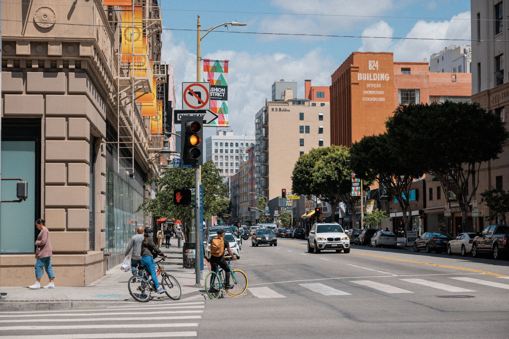
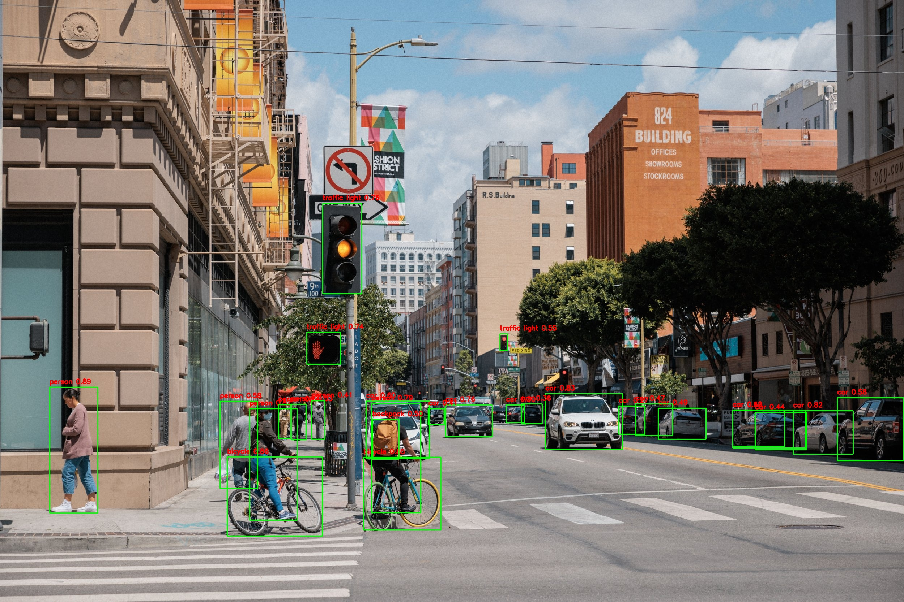

# YOLO Object Detection with Streamlit


---

## 📌 Table of Contents

- [📜 About the Project](#about-the-project)
- [📂 Folder Structure](#folder-structure)
- [⚡ Features](#features)
- [💻 Technologies](#technologies)
- [🚀 Running the Project](#running-the-project)
- [📸 Demo & Screenshots](#demo--screenshots)
- [📜 License](#license)

---

## 📜 About the Project

Welcome to the **YOLO Object Detection with Streamlit** project! This application leverages the YOLO (You Only Look Once) object detection algorithm, one of the most advanced models for identifying and classifying objects in images and videos. With **Streamlit**, a powerful framework for building interactive web applications, this project allows users to upload images or videos and receive real-time object detection results. 

The core features include real-time predictions of objects present in the media, with a seamless user interface to provide a smooth and interactive experience. Additionally, the project includes a Jupyter notebook to experiment with the **COCO dataset**, offering further insights into object detection tasks.

---

## 📂 Folder Structure

```
.
├── app.py                    # Main Streamlit app for running object detection
├── model.py                  # Code for loading and running the YOLO model
├── utils.py                  # Helper functions for image/video handling
├── run.bat                   # Batch file to run the application on Windows
├── inputs/                   # Folder containing sample input images and videos
│   ├── input_video.mp4       # Example input video
│   └── LosAngeles2022-101.jpg # Example input image
├── outputs/                  # Folder where processed outputs are stored
│   ├── predicted_image.jpg   # Image with object detections
│   └── processed_video.mp4   # Video with object detections
└── notebooks/                # Jupyter notebook for experimenting with the COCO dataset
    └── computer-vision-coco-dataset.ipynb
```

---

## ⚡ Features

- **Real-time Object Detection**: Upload an image or video, and the YOLO model will instantly identify objects within the media.
- **Interactive Streamlit Interface**: A user-friendly web interface that allows easy file uploads and displays real-time results.
- **Image and Video Processing**: Supports both image and video inputs for object detection, with visualized predictions shown directly in the app.
- **Downloadable Results**: Users can download the processed images or videos with detected objects.
- **COCO Dataset Integration**: Utilizes class names from the **COCO dataset** to classify objects in uploaded media.

---

## 💻 Technologies

- **Python 3.x**: The programming language used for development.
- **YOLO (You Only Look Once)**: A state-of-the-art object detection model.
- **Streamlit**: A Python framework for creating interactive web applications.
- **OpenCV**: A library for video processing and image manipulation.
- **PyTorch**: The framework used to run the YOLO model.
- **TQDM**: A library to create progress bars for long-running tasks.
- **FFMPEG**: A multimedia framework for video processing and format conversion.

---

## 🚀 Running the Project

### 1️⃣ Clone the repository:

```bash
$ git clone https://github.com/Basel-Amr/Sprints-AI-and-ML-Bootcamp.git
$ cd 09_GenerativeAI/56_Introduction_to_Large_Language_Modelling
```

### 2️⃣ Install dependencies:

Create a virtual environment (optional but recommended), and install the necessary libraries:

```bash
pip install -r requirements.txt
```

### 3️⃣ Run the application:

**Option 1**: Run via Command Line:

```bash
$ streamlit run app.py
```

**Option 2**: Run via `run.bat` (Windows users):

If you're on Windows, simply double-click the `run.bat` file to start the application.

---

## 📸 Demo & Screenshots

🎥 **Demo Videos**:

- 
- 
- 

🖼️ **Images**:

- **Input Image**:
  
  
- **Output Image**:
  

---

## 🎯 Developed By

**Basel Amr Barakat**  
📧 [baselamr52@gmail.com](mailto:baselamr52@gmail.com)  
💼 [LinkedIn](https://www.linkedin.com/in/baselamrbarakat/)
